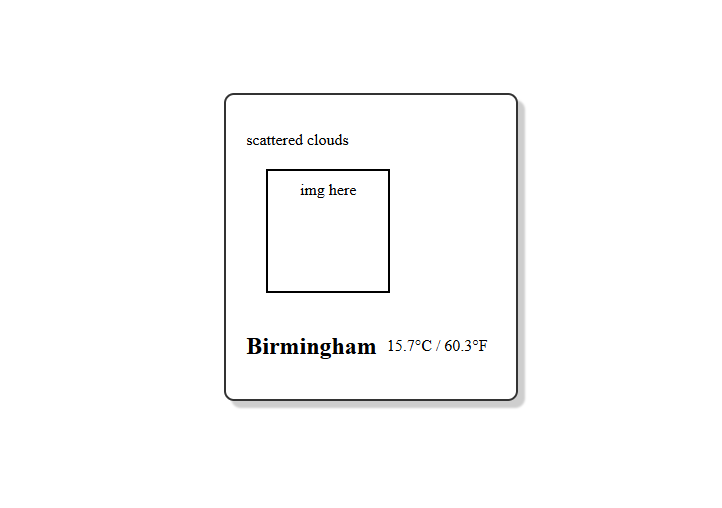

# Unique Cozy Weather Widget App

##  Overview

This project is a unique cozy, sprightly animated weather widget app built to deepen my understanding of APIs, Node.js, and full-stack development. It blends technical functionality with a Studio Ghibli-inspired aesthetic to create a warm and engaging user experience.

- **Frontend**: React, JavaScript, HTML, CSS  
- **Backend**: Node.js with Express  
- **Design Tool**: Figma  
- **Weather API**: OpenWeatherMap  

---

##  Objectives

- Learn and apply **Node.js** for backend development  
- Create a **custom Express server**  
- Integrate **OpenWeather API** for real-time weather data  
- Build a **React-based frontend** with dynamic UI  
- Design a **cozy aesthetic** with soft color palettes and sprigthly animations  
- Add **persona-driven speech bubbles** and **mood-based UI changes**

---

##  Unique Features

| Feature | Description |
|--------|-------------|
| **Cozy Aesthetic** | Soft color palettes and pixelated flame spirit inspired by Calcifer from *Howl's Moving Castle* |
| **Narrative Speech Bubbles** | Example: `"Looks like a perfect day for a blanket and tea. ☁️🍵"` |
| **Custom Moods** | Sleepy, Productive, Introvert — each with unique speech and future layout changes |
| **Auto Mood Switch** | Random mood selected daily |
| **Day/Night Cycle** | UI and flame spirit color change based on time (e.g., 20:00 UK time triggers night mode) |
| **Temperature Toggle** *(Planned)* | Switch between Celsius and Fahrenheit |
| **Persona Animation** | Flame spirit changes tone:  
  - Day: Orange, Red, Yellow  
  - Night: Blue, Cyan, Purple |

---

##  Development Timeline

### 1.  Initial Setup
- Designed mock UI in **Figma** (1.3 hrs)
 

- Created static skeleton in **React**  
 

    

### 2.  Backend Creation
- Switched from Vite to **Express server**
- Installed dependencies: `axios`, `express`, `body-parser`
- Connected to **OpenWeather API**  
 

### 3.  Frontend–Backend Integration
- React (localhost:3000) sends POST to Express (localhost:5000)
- Backend fetches weather data and returns to frontend
- Completed both backend and frontend intergration ~8 hours of resets  
   
  

### 4.  UI Implementation
- Added moving visuals from Figma mock 
 

- Speech bubble test alignment 
 

- Night mode persona added  
 

 

- Day/Night toggle test feature  
 

---

##  Challenges & Learnings

- Switched from Vite to Express for better backend control  
- Learned to handle POST requests and API integration with Axios  
- Gained hands-on experience with Figma for UI design  
- Understood the importance of syncing frontend/backend servers  

---

##  Future Improvements

- Add **temperature toggle** (°C/°F)  
- Expand **mood library** with more speech variations  
- Implement **mood-based layout changes**  
- Refactor code for scalability and modularity  
- Explore **animations** and **accessibility enhancements**

---

##  Total Time Spent

**~16 hours**  
Includes design, development, debugging, and UI implementation.

---

##  Final Thoughts

This project was a blend of creativity and technical growth. While some features are still in progress, it marks a meaningful step in my journey toward building expressive, user-centric apps. More updates coming soon!
