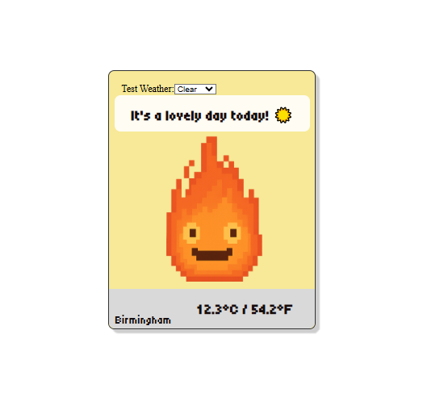
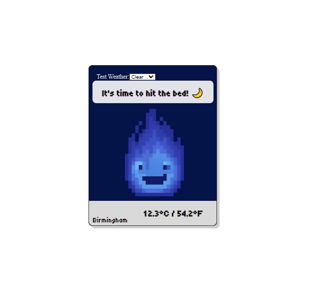
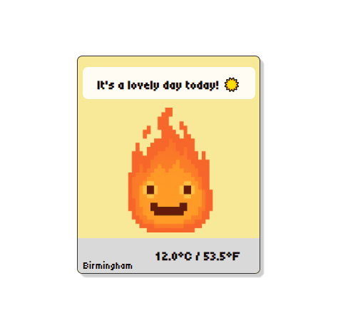

# Unique Cozy Weather Widget App – Project Breakdown
 

 
With weather description and day and night cycle test implementation.

---

Here is the final design with no test implementation.
 

 
Keep in mind that the image alternate to give it a live animation. 

##  Concept & Vision

Create a weather widget that blends real-time data with a cozy, sprightly animated aesthetic. Inspired by *Howl’s Moving Castle*, the app features a pixelated flame spirit reminiscent of Calcifer, mood-based speech bubbles, and dynamic visuals that shift with time and emotion.

---

##  Tech Stack

- **Frontend**: React, JavaScript, HTML, CSS  
- **Backend**: Node.js with Express  
- **API**: OpenWeatherMap  
- **Design Tool**: Figma  

---

##  Development Phases

### 1.  Design & Mockup
- Sketched UI layout and assets in **Figma**
- Learned Figma tools while designing (~1.3 hrs)
- Focused on soft color palettes and cozy visuals
- Designed flame spirit with day/night color shifts

### 2.  Static Frontend Setup
- Built initial React skeleton to visualize layout
- Created static components to reflect mock design
- Started with Vite, later transitioned to Express for backend

### 3.  Backend Setup
- Created custom **Express server** from scratch
- Installed dependencies: `axios`, `express`, `body-parser`
- Connected to **OpenWeather API** and fetched data successfully

### 4.  Frontend–Backend Integration
- React (localhost:3000) sends POST request to Express (localhost:5000)
- Backend fetches weather data and returns it to frontend
- Took ~8 hours due to resets and troubleshooting

### 5.  UI Implementation
- Added visuals from Figma mock
- Implemented speech bubble alignment test
- Created **day/night cycle** with persona changes
- Flame spirit color changes based on time:
  - Day: Orange, Red, Yellow  
  - Night: Blue, Cyan, Purple
- Added test toggle for day/night mode

---

##  Mood System (soon to come)

- **Three moods**: Sleepy, Productive, Introvert
- Each mood has unique speech bubble text
- Future update: mood-based layout changes
- Added **auto mood switch** that selects a random mood daily

---

## ⏱ Time Summary

- **Total time spent**: ~16 hours  
  - Design: 1.3 hrs  
  - Static frontend: 2 hrs  
  - Backend setup: 3 hrs  
  - Integration: 8 hrs  
  - UI polish & testing: 1.7 hrs  

---

##  Future Plans

- Add **temperature toggle** (°C/°F)  
- Expand **mood library** with more speech variations  
- Implement **mood-based layout themes**  
- Refactor code for scalability and modularity  
- Add accessibility and animation enhancements

---

## To run the app

- Open terminal
- Type "cd server" then "npm run start" - server will start running on localhost:5000
- Open another terminal
- Type "cd client" then "npm run start" - it will take few minutes to open.

"# Unique-weather-app" 
"# Unique-weather-app" 
"# Unique-weather-app" 
"# Unique-weather-app" 
"# Unique-weather-app" 
